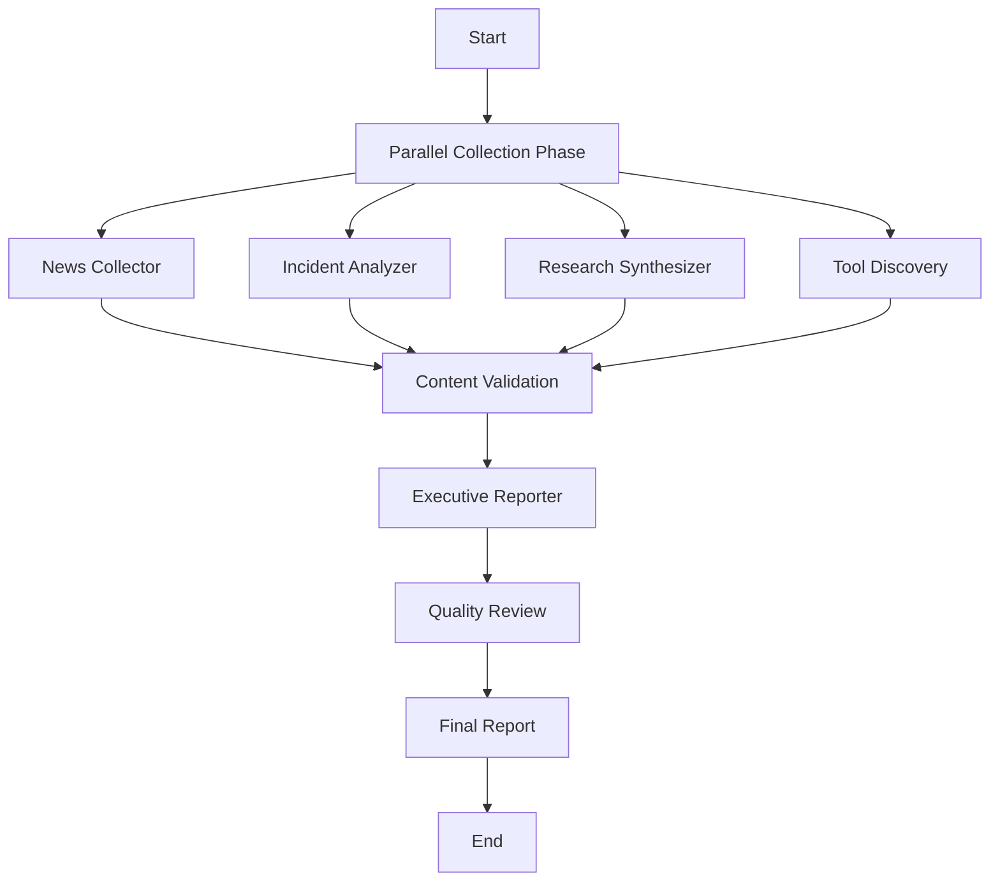

# AI Agent System for Threat Intelligence Automation - Design v0.1

**Version:** 0.1  
**Date:** January 3, 2026  
**Author:** AI Security Threat Intelligence Team  

## Overview

This document outlines the design for an automated AI agent system that generates executive summaries on the AI security landscape. The system leverages Gemini API for content analysis and LangGraph for workflow orchestration to produce structured threat intelligence reports.

## System Architecture

### Core Components

The system consists of five specialized agents orchestrated through LangGraph:

1. **News Collector Agent**
2. **Incident Analyzer Agent** 
3. **Research Synthesizer Agent**
4. **Tool Discovery Agent**
5. **Executive Reporter Agent**

### Technology Stack

- **Orchestration:** LangGraph
- **AI Engine:** Google Gemini API
- **Language:** Python
- **Data Sources:** HackerNews, Security Feeds, Academic Papers, GitHub

## Agent Specifications

### 1. News Collector Agent

**Purpose:** Aggregate AI security news from primary sources

**Responsibilities:**
- Scrape HackerNews for AI/ML security discussions
- Monitor major security news outlets
- Filter content for AI-specific threats and developments
- Deduplicate and timestamp findings
- Avoid vendor blogs to prevent information overload

**Inputs:** RSS feeds, API endpoints, web scraping targets  
**Outputs:** Structured news items with metadata

### 2. Incident Analyzer Agent

**Purpose:** Process and categorize security incidents

**Responsibilities:**
- Monitor CVE databases for AI/ML vulnerabilities
- Track security advisories and disclosures
- Categorize incidents by type:
  - Prompt injections
  - Data poisoning attacks
  - Model theft/extraction
  - Training data leaks
- Extract technical details and impact assessments

**Inputs:** CVE feeds, security advisories, incident reports  
**Outputs:** Categorized incident summaries with risk ratings

### 3. Research Synthesizer Agent

**Purpose:** Analyze academic and research developments

**Responsibilities:**
- Monitor arXiv and security conference papers
- Identify new offensive techniques
- Track defensive research and countermeasures
- Synthesize emerging threat patterns
- Evaluate practical applicability of research

**Inputs:** Academic papers, conference proceedings, research repositories  
**Outputs:** Research summaries with practical implications

### 4. Tool Discovery Agent

**Purpose:** Track new security tooling for AI/ML pipelines

**Responsibilities:**
- Monitor GitHub releases for AI security tools
- Track commercial tool announcements
- Categorize tools by pipeline stage (training, inference, deployment)
- Evaluate tool adoption potential and effectiveness
- Focus on open-source and widely-adopted solutions

**Inputs:** GitHub API, tool registries, vendor announcements  
**Outputs:** Tool inventory with categorization and assessment

### 5. Executive Reporter Agent

**Purpose:** Synthesize findings into executive summaries

**Responsibilities:**
- Aggregate outputs from all collection agents
- Generate structured reports following the 5-section format:
  1. Key News & Announcements
  2. Significant Incidents
  3. New Offensive/Defensive Approaches
  4. New Tooling
  5. Executive Summary
- Maintain consistent tone and format
- Provide business impact assessments

**Inputs:** Processed data from all agents  
**Outputs:** Executive summary report

## LangGraph Workflow Design

### Execution Flow



### Phase Descriptions

#### Phase 1: Parallel Collection (Concurrent)
- All collection agents execute simultaneously
- Time-bounded execution (configurable timeout)
- Error handling for individual agent failures
- Progress tracking and logging

#### Phase 2: Content Validation (Sequential)
- Filter AI-specific content
- Remove duplicates across sources
- Validate data quality and completeness
- Apply relevance scoring

#### Phase 3: Synthesis (Sequential)
- Executive Reporter processes all validated content
- Generates structured output following template
- Applies business context and impact analysis

#### Phase 4: Quality Control (Sequential)
- Automated review for completeness
- Format validation
- Final output generation

## Gemini API Integration

### Usage Patterns

1. **Content Analysis**
   - Deep understanding of technical content
   - Context extraction from unstructured data
   - Relevance scoring and filtering

2. **Summarization**
   - Executive-level summaries of technical findings
   - Key point extraction from lengthy documents
   - Impact assessment generation

3. **Classification**
   - Automatic categorization of threats and incidents
   - Severity and priority scoring
   - Trend identification

4. **Quality Assurance**
   - Report completeness validation
   - Consistency checking across sections
   - Tone and format standardization

### API Configuration

- **Model:** Gemini Pro for complex analysis tasks
- **Rate Limiting:** Implement backoff strategies
- **Error Handling:** Fallback mechanisms for API failures
- **Cost Optimization:** Batch processing where possible

## Configuration System

### Configurable Parameters

```yaml
# Time Configuration
lookback_period: "14 days"
execution_frequency: "weekly"
timeout_per_agent: "300 seconds"

# Source Configuration
news_sources:
  - "hackernews"
  - "threatpost"
  - "securityweek"

incident_sources:
  - "cve_database"
  - "security_advisories"

research_sources:
  - "arxiv"
  - "security_conferences"

# Output Configuration
report_format: "markdown"
sections:
  - "key_news"
  - "incidents"
  - "research"
  - "tooling"
  - "executive_summary"

# API Configuration
gemini:
  model: "gemini-pro"
  max_tokens: 8192
  temperature: 0.3
```

## Data Flow

### Input Sources
- **Primary:** HackerNews, major security outlets
- **Secondary:** CVE databases, academic repositories
- **Tertiary:** GitHub releases, tool announcements

### Processing Pipeline
1. **Collection:** Raw data gathering from sources
2. **Filtering:** AI/ML security relevance check
3. **Analysis:** Content understanding and categorization
4. **Synthesis:** Cross-source correlation and summarization
5. **Reporting:** Structured output generation

### Output Format
- **Primary:** Markdown executive summary
- **Secondary:** JSON structured data for further processing
- **Metadata:** Source attribution, confidence scores, timestamps

## Quality Assurance

### Validation Criteria
- **Completeness:** All 5 sections populated
- **Relevance:** AI/ML security focus maintained
- **Accuracy:** Source verification and fact-checking
- **Timeliness:** Content within specified lookback period
- **Consistency:** Standardized format and tone

### Error Handling
- **Agent Failures:** Graceful degradation with partial results
- **API Limits:** Rate limiting and retry mechanisms
- **Data Quality:** Validation and filtering of poor-quality sources
- **Network Issues:** Offline mode with cached data

## Performance Considerations

### Scalability
- **Parallel Processing:** Concurrent agent execution
- **Caching:** Intelligent caching of processed content
- **Incremental Updates:** Process only new content since last run
- **Resource Management:** Memory and CPU optimization

### Monitoring
- **Agent Performance:** Execution time and success rates
- **Data Quality:** Source reliability and content relevance
- **API Usage:** Cost tracking and optimization
- **Output Quality:** User feedback integration

## Future Enhancements (v0.2+)

### Planned Features
- **Interactive Queries:** Ad-hoc threat intelligence requests
- **Trend Analysis:** Historical pattern recognition
- **Alert System:** Real-time notifications for critical threats
- **Custom Sources:** User-defined data source integration
- **Multi-format Output:** PDF, HTML, and API endpoints

### Technical Improvements
- **Advanced NLP:** Enhanced content understanding
- **Machine Learning:** Automated relevance scoring
- **Integration APIs:** Third-party security tool integration
- **Dashboard:** Web-based monitoring and control interface

## Implementation Timeline

### Phase 1 (Weeks 1-2)
- Core agent framework development
- LangGraph workflow implementation
- Basic Gemini API integration

### Phase 2 (Weeks 3-4)
- Agent-specific logic implementation
- Configuration system development
- Testing and validation

### Phase 3 (Weeks 5-6)
- Performance optimization
- Error handling and monitoring
- Documentation and deployment

## Success Metrics

### Quantitative
- **Coverage:** % of relevant AI security news captured
- **Accuracy:** Manual validation of report quality
- **Performance:** Execution time and resource usage
- **Cost:** Gemini API usage and optimization

### Qualitative
- **Usefulness:** Stakeholder feedback on report value
- **Completeness:** Coverage of all required sections
- **Clarity:** Executive-level accessibility of content
- **Actionability:** Practical insights for decision-making

---

**Document Status:** Draft v0.1  
**Next Review:** January 10, 2026  
**Approval Required:** Technical Lead, Security Team Lead
