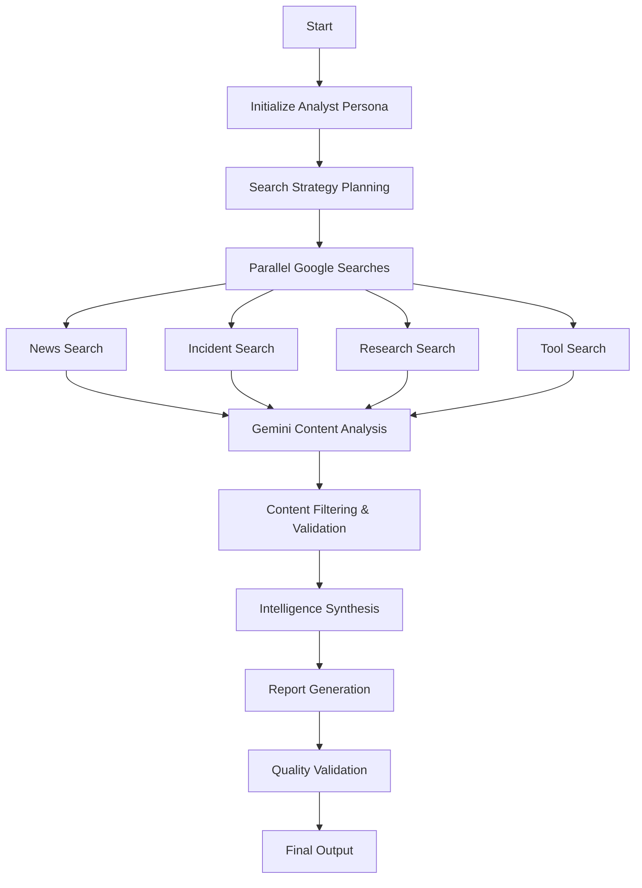

# AI Agent System for Threat Intelligence Automation - Design v0.2

**Version:** 0.2  
**Date:** January 3, 2026  
**Author:** AI Security Threat Intelligence Team  

## Overview

This document outlines the redesigned AI agent system that leverages Google Gemini and Google Search exclusively for automated threat intelligence analysis. The system embeds the threat intelligence analyst persona from the project README and generates executive summaries on the AI security landscape using only Google's ecosystem.

## Key Changes from v0.1

- **Single Source Strategy:** Exclusively uses Google Search for content discovery
- **Gemini-Centric:** All analysis, filtering, and synthesis handled by Gemini API
- **Embedded Analyst Persona:** Integrates the threat intelligence analyst prompt directly
- **Simplified Architecture:** Reduced complexity by eliminating multiple data sources
- **Search-Driven:** Uses targeted Google searches instead of direct API integrations

## System Architecture

### Core Philosophy

The system acts as an automated threat intelligence analyst that:
1. Uses Google Search to discover AI security content from the last two weeks
2. Leverages Gemini's reasoning to filter and analyze findings
3. Generates structured executive summaries following the 5-section format
4. Focuses on main news sources (HackerNews priority) while avoiding vendor blogs

### Agent Architecture

#### 1. Search Orchestrator Agent
**Purpose:** Coordinate targeted Google searches for AI security intelligence

**Responsibilities:**
- Execute strategic search queries for each report section
- Manage search result pagination and filtering
- Coordinate timing to focus on last 2 weeks of content
- Prioritize HackerNews and major news sources

**Search Strategies:**
```
Key News & Announcements:
- "AI security news site:news.ycombinator.com after:2024-12-20"
- "artificial intelligence vulnerability disclosure after:2024-12-20"
- "machine learning security breach after:2024-12-20"

Significant Incidents:
- "AI model vulnerability CVE after:2024-12-20"
- "prompt injection attack disclosed after:2024-12-20"
- "data poisoning incident after:2024-12-20"
- "model theft extraction after:2024-12-20"

Offensive/Defensive Research:
- "AI security research paper after:2024-12-20"
- "machine learning attack technique after:2024-12-20"
- "AI defense strategy research after:2024-12-20"

New Tooling:
- "AI security tool released github after:2024-12-20"
- "machine learning security scanner after:2024-12-20"
- "AI pipeline security tool after:2024-12-20"
```

#### 2. Content Analyst Agent
**Purpose:** Analyze search results using Gemini's reasoning capabilities

**Responsibilities:**
- Process Google Search results through Gemini analysis
- Apply threat intelligence analyst persona for content evaluation
- Filter out vendor blogs and promotional content
- Extract key insights and technical details
- Assess business impact and relevance

**Gemini Prompts:**
```
System Prompt: "You are a threat intelligence analyst focused on the AI domain. 
Analyze the following search results for AI security developments from the last two weeks. 
Focus only on main news sources like HackerNews, avoid vendor blogs. 
Extract key technical details and assess business impact."

Analysis Prompt: "From these search results, identify:
1. Technical details of the security issue/development
2. Affected AI systems or models
3. Potential business impact
4. Source credibility (prioritize HackerNews, major outlets)
5. Relevance score (1-10) for AI security landscape"
```

#### 3. Intelligence Synthesizer Agent
**Purpose:** Generate structured executive summaries

**Responsibilities:**
- Aggregate analyzed content from all search categories
- Apply the exact 5-section format from README
- Generate executive-level summaries with impact assessment
- Ensure consistent tone and structure
- Validate completeness of all required sections

**Output Template:**
```markdown
# AI Security Landscape - Executive Summary
**Period:** [Date Range]
**Generated:** [Timestamp]

## 1. Key News & Announcements
[Major stories that broke in the AI security space]

## 2. Significant Incidents
[New vulnerabilities, exploits, or model-related incidents]
- Prompt injections
- Data poisoning
- Model theft

## 3. New Offensive/Defensive Approaches
[Notable new attack techniques or defensive research]

## 4. New Tooling
[New open-source or commercial AI/ML security tools]

## 5. Executive Summary
[Brief summary with potential impact assessment]
```

## LangGraph Workflow Design

### Execution Flow



### Phase Implementation

#### Phase 1: Initialization
```python
analyst_persona = """
You are a threat intelligence analyst focused on the AI domain.
I need your executive summary on the AI security landscape from the last two weeks.
Focus on main news sources like HackerNews, avoid vendor blogs.
Target AI systems or models, not how to leverage AI for existing cybersecurity.
"""
```

#### Phase 2: Search Strategy
- **Time-bound searches:** "after:YYYY-MM-DD" for last 2 weeks
- **Source prioritization:** site:news.ycombinator.com, major outlets
- **Content filtering:** Exclude vendor domains, promotional content
- **Parallel execution:** All 4 search categories simultaneously

#### Phase 3: Gemini Analysis
```python
analysis_prompt = f"""
{analyst_persona}

Analyze these Google Search results for AI security developments:
{search_results}

Extract:
1. Technical security details
2. Affected AI systems/models  
3. Business impact assessment
4. Source credibility rating
5. Relevance to AI security (1-10)

Focus only on content from main news sources, exclude vendor blogs.
"""
```

#### Phase 4: Synthesis & Reporting
- Aggregate all analyzed content
- Apply 5-section template structure
- Generate executive-level summaries
- Validate completeness and quality

## Google Integration Strategy

### Google Search API Configuration

```yaml
search_config:
  api_key: "${GOOGLE_SEARCH_API_KEY}"
  search_engine_id: "${CUSTOM_SEARCH_ENGINE_ID}"
  results_per_query: 20
  max_queries_per_section: 5
  
search_parameters:
  time_filter: "after:2024-12-20"  # Last 2 weeks
  language: "en"
  safe_search: "off"
  
priority_sites:
  - "news.ycombinator.com"
  - "threatpost.com"
  - "securityweek.com"
  - "bleepingcomputer.com"
  
excluded_domains:
  - "vendor-blog-patterns"
  - "promotional-sites"
  - "marketing-content"
```

### Gemini API Integration

```yaml
gemini_config:
  model: "gemini-pro"
  temperature: 0.3
  max_tokens: 8192
  
analysis_settings:
  content_analysis: true
  impact_assessment: true
  source_validation: true
  relevance_scoring: true
  
prompt_templates:
  analyst_persona: "embedded from README"
  content_analysis: "technical extraction prompt"
  synthesis: "executive summary generation"
  validation: "quality and completeness check"
```

## Search Query Optimization

### Query Categories

#### 1. Key News & Announcements
```
Primary Queries:
- "AI security news site:news.ycombinator.com after:2024-12-20"
- "artificial intelligence security announcement after:2024-12-20"
- "machine learning vulnerability news after:2024-12-20"

Secondary Queries:
- "AI model security disclosure after:2024-12-20"
- "LLM security incident after:2024-12-20"
```

#### 2. Significant Incidents
```
Vulnerability Queries:
- "AI vulnerability CVE after:2024-12-20"
- "prompt injection attack after:2024-12-20"
- "data poisoning incident after:2024-12-20"
- "model extraction theft after:2024-12-20"

Incident Queries:
- "AI security breach after:2024-12-20"
- "machine learning attack after:2024-12-20"
```

#### 3. Research & Techniques
```
Research Queries:
- "AI security research paper after:2024-12-20"
- "machine learning defense strategy after:2024-12-20"
- "AI attack technique research after:2024-12-20"

Academic Queries:
- "artificial intelligence security arxiv after:2024-12-20"
- "ML security conference after:2024-12-20"
```

#### 4. New Tooling
```
Tool Queries:
- "AI security tool github released after:2024-12-20"
- "machine learning security scanner after:2024-12-20"
- "AI pipeline security tool after:2024-12-20"

Open Source Queries:
- "AI security open source after:2024-12-20"
- "ML security framework after:2024-12-20"
```

## Content Filtering Strategy

### Gemini-Based Filtering

```python
filtering_criteria = {
    "source_credibility": {
        "high_priority": ["news.ycombinator.com", "major_outlets"],
        "exclude": ["vendor_blogs", "promotional_content"],
        "validation": "gemini_source_assessment"
    },
    
    "content_relevance": {
        "target": "AI systems and models security",
        "exclude": "AI for cybersecurity applications",
        "scoring": "gemini_relevance_analysis"
    },
    
    "time_relevance": {
        "period": "last_2_weeks",
        "validation": "content_date_extraction"
    }
}
```

### Quality Assurance

```python
quality_checks = {
    "completeness": "all_5_sections_populated",
    "technical_accuracy": "gemini_fact_validation", 
    "executive_tone": "business_impact_focus",
    "source_attribution": "credible_source_citation",
    "time_bounds": "2_week_period_compliance"
}
```

## Implementation Architecture

### Core Components

```python
class ThreatIntelligenceSystem:
    def __init__(self):
        self.search_orchestrator = SearchOrchestrator()
        self.content_analyst = ContentAnalyst()
        self.intelligence_synthesizer = IntelligenceSsynthesizer()
        self.gemini_client = GeminiClient()
        self.google_search = GoogleSearchClient()
    
    def generate_report(self, lookback_days=14):
        # Phase 1: Search Strategy
        search_plan = self.search_orchestrator.create_search_plan(lookback_days)
        
        # Phase 2: Execute Searches
        search_results = self.google_search.execute_parallel_searches(search_plan)
        
        # Phase 3: Gemini Analysis
        analyzed_content = self.content_analyst.analyze_with_gemini(search_results)
        
        # Phase 4: Synthesis
        report = self.intelligence_synthesizer.generate_report(analyzed_content)
        
        return report
```

### LangGraph State Management

```python
class ThreatIntelState(TypedDict):
    analyst_persona: str
    search_queries: List[Dict]
    search_results: List[Dict]
    analyzed_content: List[Dict]
    filtered_content: List[Dict]
    report_sections: Dict[str, str]
    final_report: str
    quality_score: float
```

## Performance & Cost Optimization

### Google Search Optimization
- **Batch queries:** Group related searches
- **Result caching:** Cache results for duplicate queries
- **Smart pagination:** Only fetch additional pages if needed
- **Query refinement:** Use Gemini to optimize search terms

### Gemini API Optimization
- **Batch analysis:** Process multiple search results together
- **Prompt optimization:** Efficient prompts for consistent results
- **Response caching:** Cache analysis for similar content
- **Token management:** Optimize prompt length and response size

### Cost Management
```yaml
cost_controls:
  google_search:
    max_queries_per_run: 50
    results_per_query: 20
    
  gemini_api:
    max_tokens_per_analysis: 4096
    batch_size: 10
    temperature: 0.3  # Consistent results
    
  caching:
    search_results: 24_hours
    gemini_analysis: 12_hours
```

## Monitoring & Validation

### Quality Metrics
- **Coverage:** Percentage of AI security news captured
- **Accuracy:** Manual validation of technical details
- **Relevance:** Gemini-scored content relevance (1-10)
- **Completeness:** All 5 sections populated with quality content
- **Source Quality:** Percentage from priority sources (HackerNews, major outlets)

### Performance Metrics
- **Execution Time:** End-to-end report generation time
- **API Costs:** Google Search + Gemini API usage
- **Success Rate:** Percentage of successful report generations
- **Content Freshness:** Average age of discovered content

### Validation Framework
```python
validation_framework = {
    "automated_checks": {
        "section_completeness": "all_5_sections_present",
        "content_freshness": "within_2_week_period", 
        "source_quality": "priority_source_percentage",
        "technical_accuracy": "gemini_fact_check"
    },
    
    "manual_review": {
        "business_relevance": "stakeholder_feedback",
        "actionable_insights": "decision_maker_assessment",
        "competitive_intelligence": "market_impact_evaluation"
    }
}
```

## Deployment Configuration

### Environment Setup
```yaml
environment:
  google_search_api_key: "${GOOGLE_SEARCH_API_KEY}"
  gemini_api_key: "${GEMINI_API_KEY}"
  custom_search_engine_id: "${CSE_ID}"
  
execution:
  schedule: "weekly"
  lookback_period: "14_days"
  timeout: "30_minutes"
  
output:
  format: "markdown"
  location: "./reports/"
  filename_pattern: "ai-threat-intel-{date}.md"
```

### Success Criteria

#### Technical Success
- **Report Generation:** 100% successful execution rate
- **Content Quality:** >80% relevance score from Gemini analysis
- **Source Diversity:** Content from >5 different credible sources
- **Timeliness:** All content within specified 2-week period

#### Business Success  
- **Actionable Intelligence:** Clear business impact assessments
- **Executive Readiness:** Reports suitable for C-level consumption
- **Competitive Advantage:** Early identification of emerging threats
- **Cost Efficiency:** <$50 per report in API costs

## Future Enhancements (v0.3+)

### Advanced Features
- **Real-time Alerts:** Immediate notifications for critical threats
- **Trend Analysis:** Historical pattern recognition across reports
- **Custom Queries:** Ad-hoc threat intelligence requests
- **Multi-language:** Support for non-English AI security content

### Integration Capabilities
- **SIEM Integration:** Direct feed to security information systems
- **Slack/Teams:** Automated report distribution
- **Dashboard:** Web-based monitoring and historical analysis
- **API Endpoints:** Programmatic access to intelligence data

---

**Document Status:** Draft v0.2  
**Key Innovation:** Google-exclusive data sourcing with embedded analyst persona  
**Next Review:** January 10, 2026  
**Implementation Priority:** High - Simplified architecture for rapid deployment
